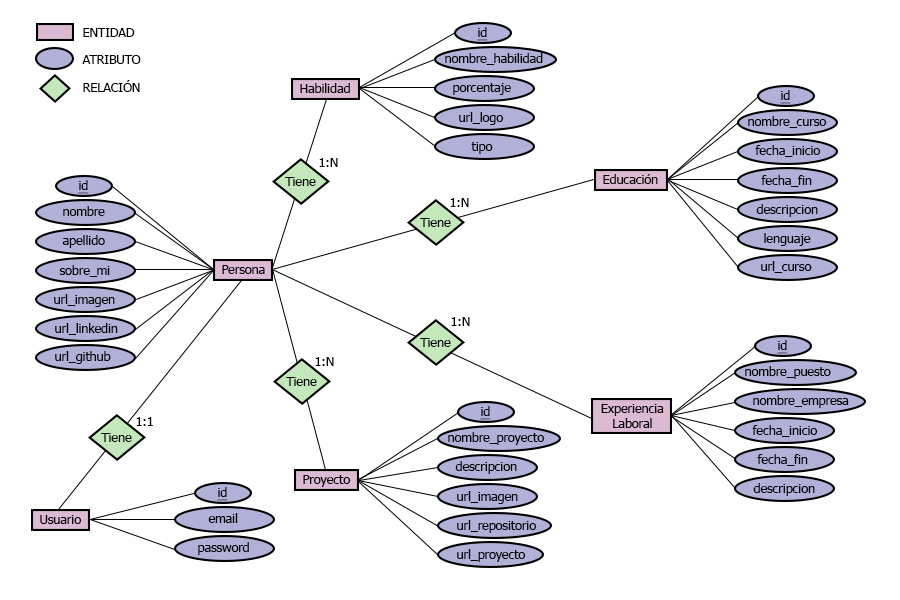

# Portfolio Web :computer:

Bienvenido al Repositorio Back End de mi Portfolio Web. El Repositorio Front End se encuentra [aquí](https://github.com/vaneh14/PortfolioFrontEnd).

Este Repositorio aloja el desarrollo de la capa Back End del Proyecto Integrador de la segunda etapa de **Argentina Programa, #Yo Programo**. Consiste en el diseño y creación de API Rest utilizando el lenguaje [Java](https://www.java.com/es/) y [Spring Boot](https://spring.io/) 3.0.5 bajo el patrón MVC, conectado a una base de datos relacional [MySQL](https://www.mysql.com/) 8.0.32.

## Diagrama Entidad Relación

En este diagrama se plasman las entidades, atributos y relaciones que compondrán las distintas tablas de la Base de Datos. 

    

## Autorización y Autenticación

Este proyecto implementa seguridad con [Spring Security](https://spring.io/projects/spring-security) y [JSON Web Token](https://jwt.io/) 0.11.5. A partir de la autenticacion mediante el _usuario_ y _contraseña_ del administrador se genera un token de acceso (JWT) que autorizará el acceso a los recursos protegidos de la API.

    
    

## Instalación

Para ver una vista previa de manera local se deberá:

1. Clonar el repositorio: `https://github.com/vaneh14/PortfolioBackEnd.git`
2. Instalar las dependencias necesarias mediante `build`
3. Configurar el archivo `src/main/resources/application.properties`
4. Ejecutar la aplicación mediante el comando `run file` del archivo `BackEndApplication.java`
5. La aplicación estará disponible en `http://localhost:8080/`

## Sobre mí

Hola, soy Vanesa! 👋 😄 Me encuentro realizando mis primeros pasos en el mundo del desarrollo web. Te invito a pasar por mi [repositorio](https://github.com/vaneh14) y contactarme.  
